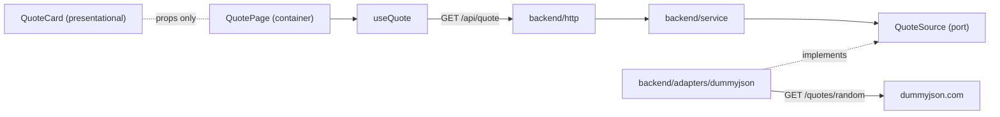
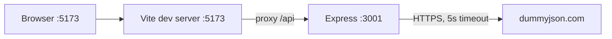

# Architecture Spine — Random Quote Generator

## Design Paradigm

Backend: hexagonal. `http` (driving adapter) calls `service`, which depends on the `QuoteSource` port; `dummyjson` (driven adapter) implements it. Frontend: container/presentational, with a `useQuote` hook owning all fetch state.



Dependency rule: inward only. `service` and the port never import Express, `fetch`, or adapter code.

## Invariants & Rules

### AD-1 — Data source sits behind a port [ADOPTED]

- **Binds:** FR-1, FR-2, FR-5, backend
- **Prevents:** Upstream URL, fetch calls, or upstream response shapes leaking into routes or service.
- **Rule:** `service` depends only on `QuoteSource.getRandom(): Promise<Quote>`. Only `adapters/dummyjson` knows the upstream URL, timeout, and wire format. Adapters throw `UpstreamError`; no other module catches raw fetch errors.

### AD-2 — Quote contract is passthrough and exact [ADOPTED]

- **Binds:** FR-3, FR-4, backend, frontend
- **Prevents:** Case normalization, field renaming, or divergent shapes between backend and UI.
- **Rule:** `Quote = { id: number; quote: string; author: string }`, defined once in each package with identical fields. Text is never transformed on either side.

### AD-3 — One error shape, mapped at the HTTP edge [ADOPTED]

- **Binds:** FR-5, FR-11, backend `http`, frontend `useQuote`
- **Prevents:** Crashes, HTML error pages, and the UI parsing ad-hoc failures.
- **Rule:** `UpstreamError` (including the 5 s timeout) maps to HTTP 502 with `{ "error": string }`. Any other failure maps to 500 with the same shape. `useQuote` treats any non-2xx or network failure as one `error` state.

### AD-4 — Same-origin `/api`, no CORS code [ASSUMPTION]

- **Binds:** FR-6, NFR-4, frontend, backend
- **Prevents:** Hardcoded backend URLs in the UI and per-origin CORS config.
- **Rule:** The frontend calls only relative `/api/*`. Vite dev server proxies `/api` to the backend port. The backend adds no CORS middleware.

### AD-5 — All fetch state lives in `useQuote` [ADOPTED]

- **Binds:** FR-8, FR-9, FR-10, FR-11, NFR-3, frontend
- **Prevents:** Presentational components fetching, and inconsistent loading/error behavior.
- **Rule:** `useQuote` returns `{ quote, status: 'loading' | 'ready' | 'error', refetch }`. The button is disabled while `status` is `loading`. Components under `components/` receive props only. Loading and error regions use `aria-live`, per EXPERIENCE.md.

### AD-6 — HeroUI dark theme is the only UI system [ADOPTED]

- **Binds:** FR-7, FR-12, NFR-3, frontend
- **Prevents:** Mixed component libraries, ad-hoc styling, and hardcoded colors.
- **Rule:** Use HeroUI v3 components (`Card`, `Button`, `Skeleton`) with the dark theme. Design deltas come only from DESIGN.md tokens. No other UI library. HeroUI v3 needs no provider; Tailwind CSS 4 is required.

### AD-7 — Tests mock at the port, never the network [ASSUMPTION]

- **Binds:** all (strict TDD)
- **Prevents:** Flaky tests that hit dummyjson.com, and tests coupled to the wire format.
- **Rule:** Vitest in both packages, written test-first. Service and HTTP tests use a fake `QuoteSource`. The adapter is tested against a stubbed `fetch`. Frontend tests stub the `/api/quote` response.

## Consistency Conventions

| Concern | Convention |
| --- | --- |
| Naming | Files `kebab-case.ts(x)`; React components `PascalCase`; tests colocated as `*.test.ts(x)` |
| Data & formats | JSON only; errors `{ "error": string }`; no envelope on success |
| State & cross-cutting | Backend stateless; no persistence; config read once at startup from env, with defaults; logging via `console` only |

## Stack

| Name | Version |
| --- | --- |
| Node.js (LTS "Krypton") | 24.21.0 (engines `>=24`) |
| TypeScript | 7.0.2 |
| Express | 5.2.1 |
| Vite | 8.3.4 (requires Node `^20.19 \|\| >=22.12`) |
| @vitejs/plugin-react | 6.1.2 |
| React / React DOM | 19.3.0 |
| @heroui/react, @heroui/styles | 3.2.6 |
| Tailwind CSS, @tailwindcss/vite | 4.3.3 |
| Vitest | 5.0.3 |

## Structural Seed

```text
/
  package.json          # npm workspaces: backend, frontend
  backend/
    src/
      domain/           # Quote type, UpstreamError, QuoteSource port
      service/          # getRandomQuote
      adapters/         # dummyjson adapter
      http/             # Express app, GET /api/quote, error mapping
      main.ts           # composition root, reads env, listens
  frontend/
    src/
      components/       # QuoteCard (presentational)
      hooks/            # useQuote
      pages/            # QuotePage (container)
      main.tsx
    vite.config.ts      # react + tailwind plugins, /api proxy
```

Runtime envelope: local only, two processes, one documented command each (`npm run dev -w backend`, `npm run dev -w frontend`).



| Env var | Default | Owner |
| --- | --- | --- |
| `PORT` | 3001 | backend |
| `UPSTREAM_URL` | `https://dummyjson.com/quotes/random` | backend adapter |
| `UPSTREAM_TIMEOUT_MS` | 5000 | backend adapter |

## Capability → Architecture Map

| Capability / Area | Lives in | Governed by |
| --- | --- | --- |
| FR-1..FR-5 quote API | `backend/http`, `service`, `adapters` | AD-1, AD-2, AD-3 |
| FR-6 dev access | `frontend/vite.config.ts` | AD-4 |
| FR-7..FR-12 quote page | `frontend/components`, `hooks`, `pages` | AD-5, AD-6 |
| NFR-1..NFR-4 | whole repo | AD-4, AD-7, runtime envelope |

## Deferred

- Deployment, hosting, CI, containers: out of scope (local demo only); revisit if the app is ever hosted.
- Authentication, rate limiting, caching, persistence: not needed in v1; the port (AD-1) leaves room to add them.
- Structured logging and metrics: `console` is enough for a demo.
- Production serving of the built frontend: undecided; dev proxy covers the demo.
- The pin for TypeScript 7.x is latest-at-authoring; downgrade to the latest 5.x if tooling friction appears.
