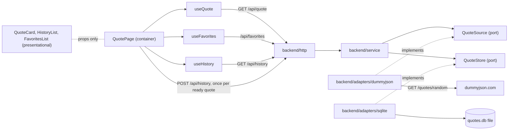
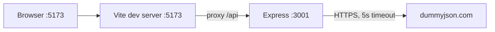

# Architecture Spine — Random Quote Generator

## Design Paradigm

Backend: hexagonal. `http` (driving adapter) calls `service`, which depends on two ports: `QuoteSource` (implemented by the `dummyjson` adapter) and `QuoteStore` (implemented by the `sqlite` adapter on better-sqlite3). Frontend: container/presentational. `useQuote` owns fetch state for the current quote; `useFavorites` owns all heart state; `useHistory` owns the history list.



Dependency rule: inward only. `service` and the ports never import Express, `fetch`, `better-sqlite3`, or adapter code.

## Invariants & Rules

### AD-1 — Data source sits behind a port [ADOPTED]

- **Binds:** FR-1, FR-2, FR-5, backend
- **Prevents:** Upstream URL, fetch calls, or upstream response shapes leaking into routes or service.
- **Rule:** `service` depends only on `QuoteSource.getRandom(): Promise<Quote>`. Only `adapters/dummyjson` knows the upstream URL, timeout, and wire format. Adapters throw `UpstreamError`; no other module catches raw fetch errors.

### AD-2 — Quote contract is passthrough and exact [ADOPTED]

- **Binds:** FR-3, FR-4, backend, frontend
- **Prevents:** Case normalization, field renaming, or divergent shapes between backend and UI.
- **Rule:** `Quote = { id: number; quote: string; author: string }`, defined once in each package with identical fields. Text is never transformed on either side.

### AD-3 — One error shape, mapped at the HTTP edge [ADOPTED]

- **Binds:** FR-5, FR-11, backend `http`, frontend `useQuote`
- **Prevents:** Crashes, HTML error pages, and the UI parsing ad-hoc failures.
- **Rule:** `UpstreamError` (including the 5 s timeout) maps to HTTP 502 with `{ "error": string }`. Invalid request bodies or ids map to 400 with the same shape. Any other failure maps to 500 with the same shape. `useQuote` treats any non-2xx or network failure as one `error` state.

### AD-4 — Same-origin `/api`, no CORS code [ASSUMPTION]

- **Binds:** FR-6, NFR-4, frontend, backend
- **Prevents:** Hardcoded backend URLs in the UI and per-origin CORS config.
- **Rule:** The frontend calls only relative `/api/*`. Vite dev server proxies `/api` to the backend, targeting `http://localhost:${PORT ?? 3001}`. The backend adds no CORS middleware.

### AD-5 — All fetch state lives in `useQuote` [ADOPTED]

- **Binds:** FR-8, FR-9, FR-10, FR-11, NFR-3, frontend
- **Prevents:** Presentational components fetching, and inconsistent loading/error behavior.
- **Rule:** `useQuote` returns `{ quote, status: 'loading' | 'ready' | 'error', refetch }` and owns only the current-quote fetch. The button is disabled while `status` is `loading`. Components under `components/` receive props only. Loading and error regions use `aria-live`, per EXPERIENCE.md. Favorites and history state live in AD-11, not here.

### AD-6 — HeroUI dark theme is the only UI system [ADOPTED]

- **Binds:** FR-7, FR-12, FR-16, NFR-3, NFR-6, frontend
- **Prevents:** Mixed component libraries, ad-hoc styling, and hardcoded colors.
- **Rule:** Use HeroUI v3 components (`Card`, `Button`, `Skeleton`) with the dark theme. The heart is one shared presentational `HeartButton` (HeroUI `Button`, icon only) used on the card and in every history row; it takes `{ isFavorite, onToggle }`, has an accessible name, and exposes state via `aria-pressed`, never color alone. Design deltas come only from DESIGN.md tokens. No other UI library. HeroUI v3 needs no provider; Tailwind CSS 4 is required.

### AD-7 — Tests mock at the port, never the network [ASSUMPTION]

- **Binds:** all (strict TDD)
- **Prevents:** Flaky tests that hit dummyjson.com, and tests coupled to the wire format.
- **Rule:** Vitest in both packages, written test-first. Service and HTTP tests use a fake `QuoteSource` and an in-memory fake `QuoteStore`. The dummyjson adapter is tested against a stubbed `fetch`. The sqlite adapter is tested against a real better-sqlite3 database (`:memory:`, plus one temp-file test that closes and reopens it to prove restart persistence, NFR-5). Frontend tests stub the `/api/*` responses.

### AD-8 — Persistence sits behind a store port, on better-sqlite3 [ADOPTED]

- **Binds:** FR-15, FR-19, NFR-5, backend
- **Prevents:** In-memory state, ad-hoc JSON files, a second database engine, and a data file that moves with the launch directory.
- **Rule:** `service` depends only on the `QuoteStore` port. Only `adapters/sqlite` imports `better-sqlite3`. The database is a single file at `DATA_FILE`; the default resolves from the backend package root (`backend/data/quotes.db`), never from the process working directory. The file is gitignored. The adapter creates the schema at startup if missing and runs with WAL off and synchronous writes. If the file is corrupt or locked, startup fails fast with a clear `console` error and a non-zero exit; the file is never auto-deleted. No database server process is ever required.
- **Port:** `QuoteStore` is synchronous (the driver is). Methods: `addHistory(quote, recordedAt): HistoryEntry`, `listHistory(): HistoryEntry[]`, `listFavorites(): Quote[]`, `addFavorite(quote, favoritedAt): void` (insert-or-ignore), `removeFavoriteAndHistory(quoteId): void` (one transaction; the only operation that deletes). `service` may wrap calls in async functions. One shared contract test suite runs against both the in-memory fake and the sqlite adapter.

### AD-9 — History is written only by explicit `POST /api/history` [ADOPTED]

- **Binds:** FR-13, FR-14, backend `http` and `service`, frontend `QuotePage`
- **Prevents:** Quotes recorded twice, never, or recorded without ever being shown (StrictMode double fetch, retries, out-of-order responses).
- **Rule:** `GET /api/quote` records nothing. The frontend calls `POST /api/history` (body `Quote`) exactly once per quote it renders in `ready` state; `QuotePage` guards with a ref keyed on the quote object so StrictMode effect re-runs do not repeat it. The service validates the body (`id` number, `quote` and `author` non-empty strings), sets `recordedAt`, and returns 201 with the `HistoryEntry`. A failed record never blocks or hides the displayed quote; it is logged to `console` only.
- **Shape:** `HistoryEntry = { entryId: number, quote: Quote, recordedAt: string }` (ISO-8601 UTC, set by the service). `entryId` is `INTEGER PRIMARY KEY AUTOINCREMENT` and defines order. `GET /api/history` returns `HistoryEntry[]` newest first (`entryId` descending), no cap, no envelope.

### AD-10 — Quote identity and favorites contract [ASSUMPTION]

- **Binds:** FR-16, FR-17, FR-18, FR-19, backend
- **Prevents:** Favorites keyed by text or by history row, `isFavorite` flags stored on history rows, and a partial unfavorite that leaves entries behind.
- **Rule:** A quote's identity is the upstream `quote.id`; no other id names a quote. Favorites are a separate table keyed by `quote.id` with a snapshot of `quote` and `author` and a `favoritedAt` ordering column; the backend is the source of truth. Routes:
  - `GET /api/favorites` returns `Quote[]`, newest favorite first.
  - `PUT /api/favorites/:id` takes a `Quote` body; the path id must equal `body.id`, else 400. A repeat `PUT` keeps the first snapshot. Returns 204.
  - `DELETE /api/favorites/:id` returns 204. If the quote is a favorite, one store transaction removes the favorite and every history row with that `quote.id`. If it is not a favorite, nothing changes and history is untouched.
  - Invalid bodies or ids return 400 with the AD-3 error shape.

### AD-11 — Frontend favorites and history have one owner each [ASSUMPTION]

- **Binds:** FR-14, FR-16, FR-17, FR-18, NFR-6, frontend
- **Prevents:** The card heart and history-row hearts disagreeing, and a stale history list after unfavorite.
- **Rule:** `useFavorites` returns `{ favorites, isFavorite(quoteId), toggle(quote), status }` and is the only source of heart state. It is called once, in `QuotePage`, and passed down as props; every `HeartButton` (card, history row, favorites row) receives the same `onToggle`, and history rows call it with `entry.quote`. `toggle` is confirm-then-update (no optimistic UI) and ignores calls for a quote id whose request is still pending. `useHistory` returns `{ history, status, refresh }`; `refresh` is latest-wins (a response from an older request is discarded). `QuotePage` calls `refresh` after each successful history `POST` and after each `toggle` that removes a favorite. Components never call `fetch`. History and favorites each render as a presentational list (`HistoryList`, `FavoritesList`). Their placement on the page is not decided here; see Open Questions.

## Consistency Conventions

| Concern | Convention |
| --- | --- |
| Naming | Files `kebab-case.ts(x)`; React components `PascalCase`; tests colocated as `*.test.ts(x)` |
| Data & formats | JSON only; errors `{ "error": string }`; no envelope on success |
| State & cross-cutting | All persistent state lives in the SQLite file behind `QuoteStore` (AD-8); no other backend state; config read once at startup from env, with defaults; logging via `console` only |

## Stack

| Name | Version |
| --- | --- |
| Node.js (LTS "Krypton") | 24.21.0 (engines `^24`, `.nvmrc`; Vitest 5.0.3 does not support Node 25) |
| TypeScript | 7.0.2 |
| Express | 5.3.0 |
| better-sqlite3 (+ @types/better-sqlite3 9.6.0) | 13.0.3 (Node `>=22`; native addon, needs a prebuilt binary or build toolchain on install) |
| @types/node | 24.19.1 |
| tsx (backend TS runner) | 4.23.15 |
| HeroUI peers: react-aria-components, react-aria, @react-aria/ssr, @react-aria/utils, @internationalized/date | install at the versions `@heroui/react` 3.2.6 requires |
| @types/react, @types/react-dom, @types/express | latest matching React 19 and Express 5 |

Frontend `tsconfig` must include `types: ["vite/client"]` (TypeScript 7 rejects bare CSS imports otherwise).
| Vite | 8.3.4 (requires Node `^20.19 \|\| >=22.12`) |
| @vitejs/plugin-react | 6.1.2 |
| React / React DOM | 19.3.0 |
| @heroui/react, @heroui/styles | 3.2.6 |
| Tailwind CSS, @tailwindcss/vite | 4.3.3 |
| Vitest | 5.0.3 |

## Structural Seed

```text
/
  package.json          # npm workspaces: backend, frontend; engines node ^24
  .nvmrc                # 24.21.0
  backend/
    src/
      domain/           # Quote type, UpstreamError, QuoteSource and QuoteStore ports
      service/          # getRandomQuote, history and favorites operations
      adapters/         # dummyjson adapter, sqlite adapter
      http/             # Express app, /api/quote, /api/history (GET, POST), /api/favorites, validation, error mapping
      main.ts           # composition root, reads env, opens the store, listens
    data/               # quotes.db (gitignored)
  frontend/
    src/
      components/       # QuoteCard, HeartButton, HistoryList, FavoritesList (presentational)
      hooks/            # useQuote, useFavorites, useHistory
      pages/            # QuotePage (container)
      main.tsx
    vite.config.ts      # react + tailwind plugins, /api proxy
```

Runtime envelope: local only, two processes, one documented command each (`npm run dev -w backend`, `npm run dev -w frontend`).



| Env var | Default | Owner |
| --- | --- | --- |
| `PORT` | 3001 | backend |
| `UPSTREAM_URL` | `https://dummyjson.com/quotes/random` | backend adapter |
| `UPSTREAM_TIMEOUT_MS` | 5000 | backend adapter |
| `DATA_FILE` | `backend/data/quotes.db` (from package root) | backend sqlite adapter |

Demo reset: stop the backend and delete the file at `DATA_FILE`; it is recreated empty at next start.

## Capability → Architecture Map

| Capability / Area | Lives in | Governed by |
| --- | --- | --- |
| FR-1..FR-5 quote API | `backend/http`, `service`, `adapters` | AD-1, AD-2, AD-3 |
| FR-6 dev access | `frontend/vite.config.ts` | AD-4 |
| FR-7..FR-12 quote page | `frontend/components`, `hooks`, `pages` | AD-5, AD-6 |
| FR-13..FR-15 history | `backend/service`, `adapters/sqlite`, `http`; `frontend/hooks/useHistory` | AD-8, AD-9, AD-11 |
| FR-16..FR-19 favorites | `backend/service`, `adapters/sqlite`, `http`; `frontend/hooks/useFavorites`, `components/HeartButton` | AD-8, AD-10, AD-11, AD-6 |
| NFR-1..NFR-4 | whole repo | AD-4, AD-7, runtime envelope |
| NFR-5 persistence | `backend/adapters/sqlite`, `DATA_FILE` | AD-8, AD-7 |
| NFR-6 heart accessibility | `frontend/components/HeartButton` | AD-6 |

## Open Questions

- None blocking. Layout of the History and Favorites lists and the heart is specified in EXPERIENCE.md and DESIGN.md (stacked sections below the card, shared `HeartButton`); AD-11 fixes ownership, not layout.

## Deferred

- Deployment, hosting, CI, containers: out of scope (local demo only); revisit if the app is ever hosted.
- Authentication, rate limiting, caching: not needed; ports leave room to add them. Single user: one shared history and favorites set per install.
- History size cap, pagination, and schema migrations beyond create-if-missing: revisit if the history grows large or the schema changes after first release.
- Structured logging and metrics: `console` is enough for a demo.
- Production serving of the built frontend: undecided; dev proxy covers the demo.
- The pin for TypeScript 7.x is latest-at-authoring; downgrade to the latest 5.x if tooling friction appears.
